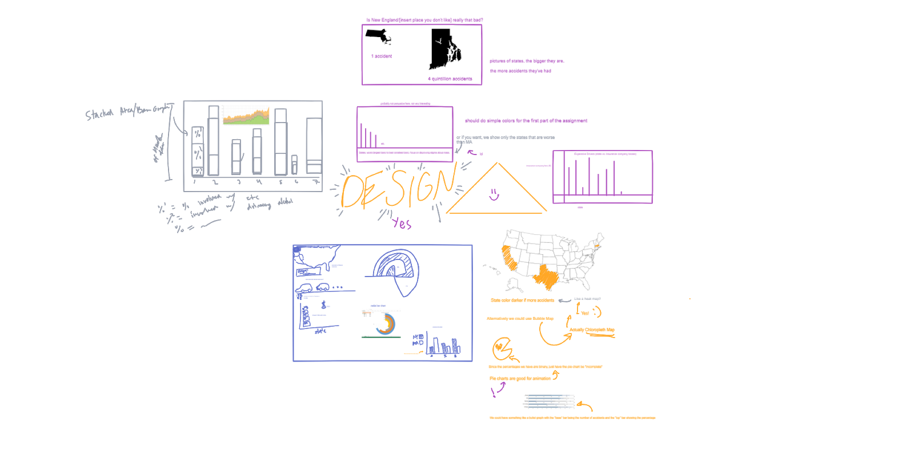

## Design Manifesto
By Dan DiIorio

Anyone can watch a YouTube video or do a Google search about the design process, and see what long-time professionals have to say about design. But the design process is not that simple. It is personalized, ever-changing, and weird. How any one person goes about designing something for anything is different from the next person.

This site is to show my own personal design process, and with it examples of when it has worked, failed, or helped me improve.

### Brainstorming

Brainstorming is a pretty simple concept - have an idea of what you want to accomplish, and generate ideas that would make that possible. Generally, it's easiest to think of as many ideas as possible, so as to be able to rule out and learn from bad ones so that eventually you'll find a good one.

Here is a great example of a brainstorming board that one of my groups put together. I chose this one because it shows how it doesn't have to be formal and not everything has to be useful, but as long as ideas are getting put onto paper then the brainstorming has been successful.



It's easy to see that there's pretty basic ideas among fairly complex ideas, useless drawing, and snippets of text in there, but that brainstorming paper was probably the most helpful one that I have had during this class.

### Refining

Ideas are just that - ideas. Without refining these ideas, all that's there is what you'd _want_ there to be. 

Once brainstorming is done with, it's time to choose that one idea that you'll eventually develop into the final product. This idea doesn't have to be one concrete idea from brainstorming; it can be a mixture of good ones, or even something totally new that you've come up with after learning from really terrible ideas that you forced yourself to come up with. Either way, the goal is to have something that you decide you will definitely be working on. 

Below is a ridiculously complex flow chart for a chatbot that talks to the user about whether or not artificial intelligence is going to take over the world. The idea with this chart is that as a group, we decided on a topic, thought about how we were going to go about delivering to the user, and ultimately developed a flowchart for a bot that we had yet to build.


One downfall of my design process so far is that in using this method, we tended towards groupthink, and stopped producing new ideas. We were set into the production of this chart so much so that it was almost not worth it to then say something like "Hey, maybe we should add _this_ topic in". Overall, I'd say that project was a great success, users liked the light-heartedness of the bot, and its playing of the devil's advocate, but it was not without its failings. 

Lastly, this step is critical. It is the point of no return (unless you're designing for fun or for a boss that really has no idea what a deadline is). Past this point in the design process, I am set on what I want to accomplish and how I am going to go about doing it.


```markdown
Syntax highlighted code block

# Header 1
## Header 2
### Header 3

- Bulleted
- List

1. Numbered
2. List

**Bold** and _Italic_ and `Code` text

[Link](url) and 
```

For more details see [GitHub Flavored Markdown](https://guides.github.com/features/mastering-markdown/).

### Jekyll Themes

Your Pages site will use the layout and styles from the Jekyll theme you have selected in your [repository settings](https://github.com/drd387/design-manifesto/settings). The name of this theme is saved in the Jekyll `_config.yml` configuration file.

### Support or Contact

Having trouble with Pages? Check out our [documentation](https://help.github.com/categories/github-pages-basics/) or [contact support](https://github.com/contact) and we’ll help you sort it out.
